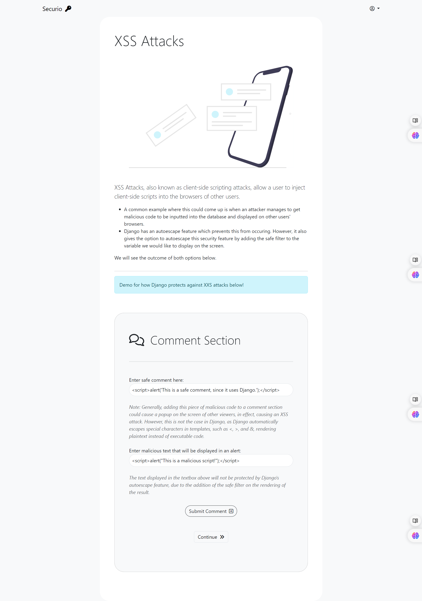
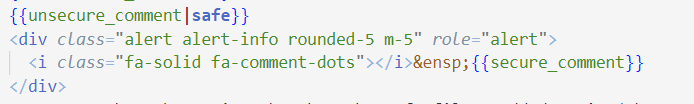
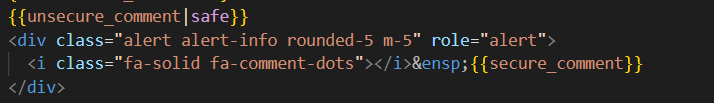
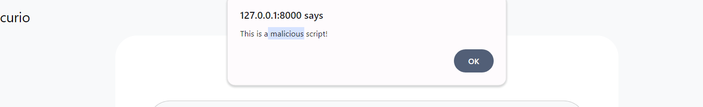
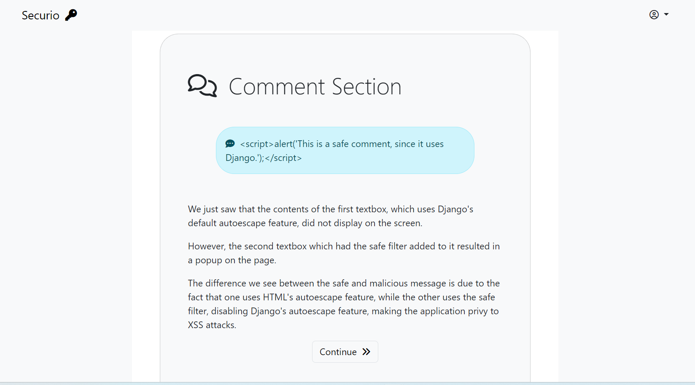
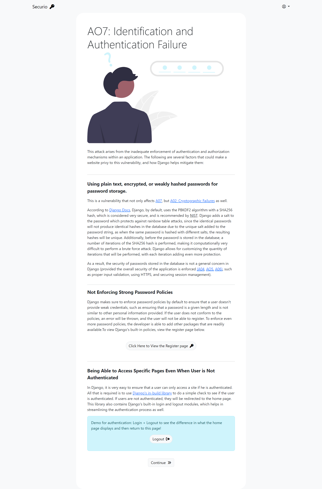
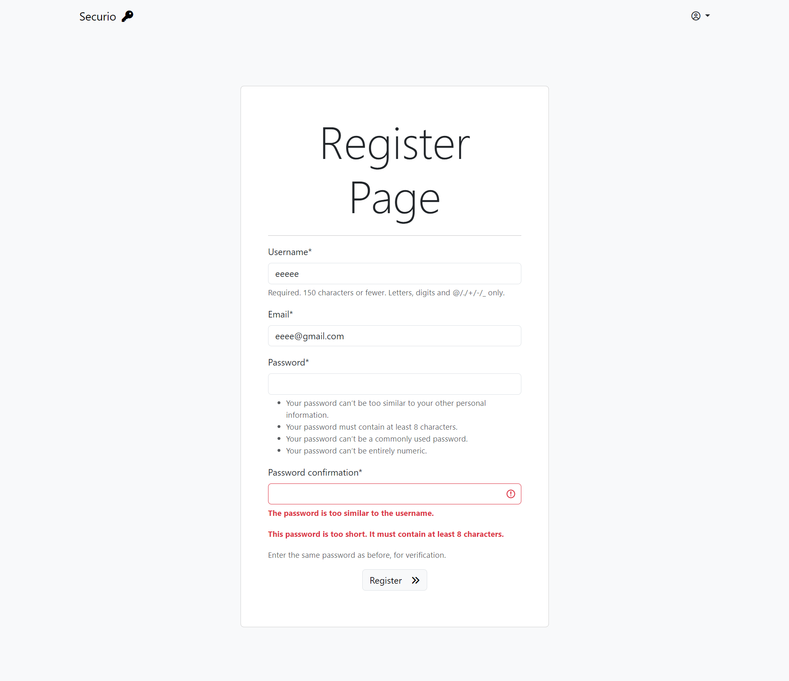
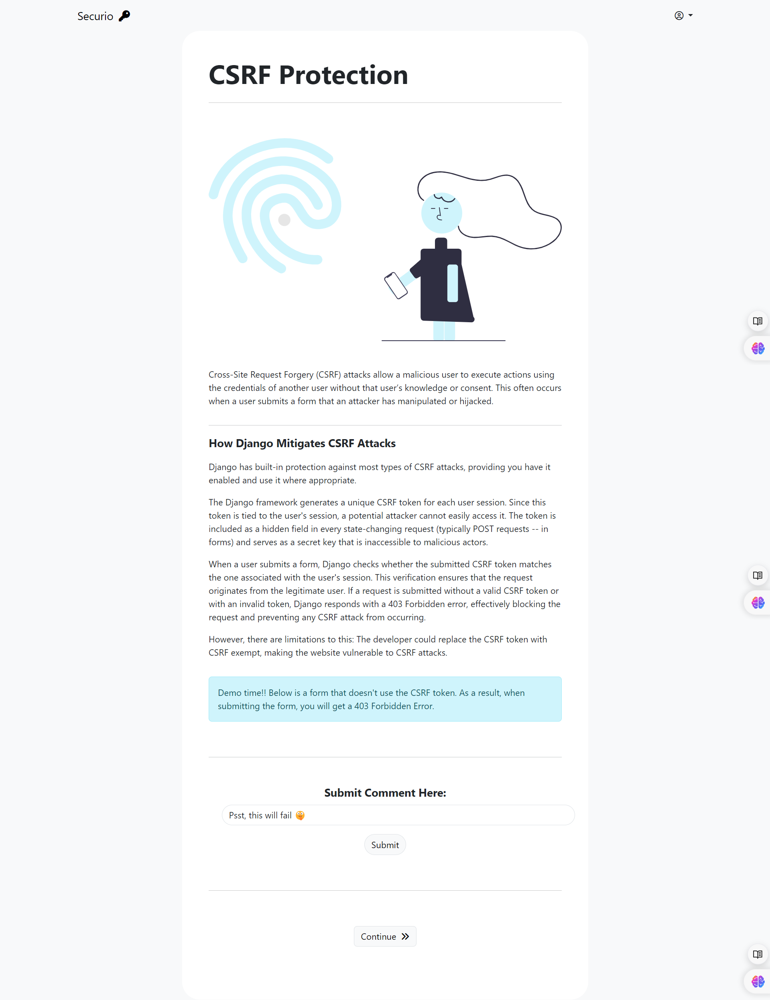

# Django Application Showcasing Django’s Security Features – Django, Python, Bootstrap, HTML, CSS

## Content of 25-minute Presentation I Gave For My Cybersecurity Course

- Developed a demonstrative hands-on website to showcase the security features Django provides, thereby mitigating many vulnerabilities, such as CSRF, XSS, SQL injections, and BAC attacks.
- Secured the admin page by changing the default URL and installing a honeypot on the imposter admin page to deceive potential attackers and gain information on potential threat actors using the website.
- Integrated Catchpta for additional protection against bots discovering the real admin page.

# XSS attacks:

https://github.com/user-attachments/assets/37d8ba0a-edcf-46ed-b4c0-40cdf0e9faf2

{{unsecure_comment|safe}}

  <i class="fa-solid fa-comment-dots"></i>&ensp;{{secure_comment}}

# AO7: Identification and Authentication Failure

https://github.com/user-attachments/assets/3c76f836-a0ba-4d37-b6a6-739a3733c707

https://github.com/user-attachments/assets/792b0879-bfad-4477-ba5f-7310b1bebb55

# CSRF

https://github.com/user-attachments/assets/4fa29e12-c4dd-4ff0-8fec-755bf1fc52b1

